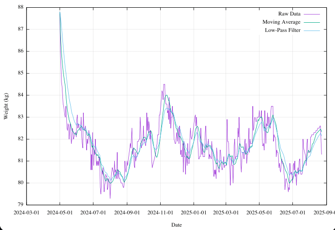

# Valanza

A weight tracking and analysis tool built the UNIX way: small, composable programs working together through pipes.

⚠️ This work is experimental and far from complete: it's intended for my personal fun and pleasure!

## Why

I didn't like the idea of having both data and logic in one spreadsheet. I want to write programs in the right language for the right task, not cram everything into huge formulas in a single cellspace.

This might evolve into a UNIX-style calc alternative how-to.

## Requirements

- bash
- R
- awk
- gnuplot
- rc (optional)

## Usage

```bash
./valanza.sh weight.txt
```

or keep only the last `DAYS` interpolated entries:

```bash
./valanza.sh weight.txt DAYS
```

or

```bash
./valanza.rc weight.txt
```

```bash
./valanza.rc weight.txt DAYS
```

## How It Works

1. **interpolate_lin.R** - Fills gaps in weight data
2. **mov_avg.awk** - Computes moving average
3. **lp1.awk** - Applies first-order low-pass filter
4. **gnuplot** - Visualizes all signals

Data flows through named pipes in RAM (when possible). Process substitution splits the stream into parallel filters, then `paste` recombines them.

## screenshot



## License

MIT License

Copyright (c) 2026 Paolo Marrone

Permission is hereby granted, free of charge, to any person obtaining a copy
of this software and associated documentation files (the "Software"), to deal
in the Software without restriction, including without limitation the rights
to use, copy, modify, merge, publish, distribute, sublicense, and/or sell
copies of the Software, and to permit persons to whom the Software is
furnished to do so, subject to the following conditions:

The above copyright notice and this permission notice shall be included in all
copies or substantial portions of the Software.

THE SOFTWARE IS PROVIDED "AS IS", WITHOUT WARRANTY OF ANY KIND, EXPRESS OR
IMPLIED, INCLUDING BUT NOT LIMITED TO THE WARRANTIES OF MERCHANTABILITY,
FITNESS FOR A PARTICULAR PURPOSE AND NONINFRINGEMENT. IN NO EVENT SHALL THE
AUTHORS OR COPYRIGHT HOLDERS BE LIABLE FOR ANY CLAIM, DAMAGES OR OTHER
LIABILITY, WHETHER IN AN ACTION OF CONTRACT, TORT OR OTHERWISE, ARISING FROM,
OUT OF OR IN CONNECTION WITH THE SOFTWARE OR THE USE OR OTHER DEALINGS IN THE
SOFTWARE.
